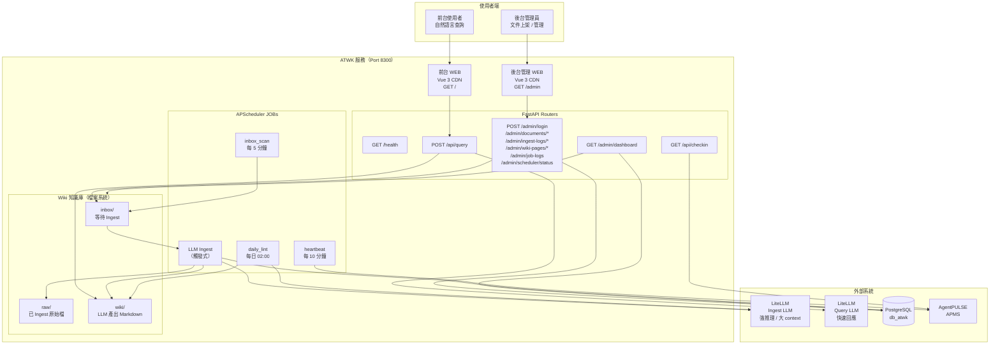
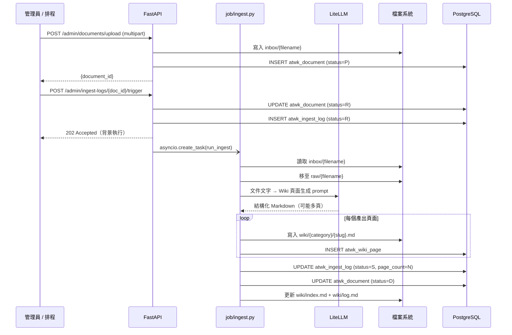
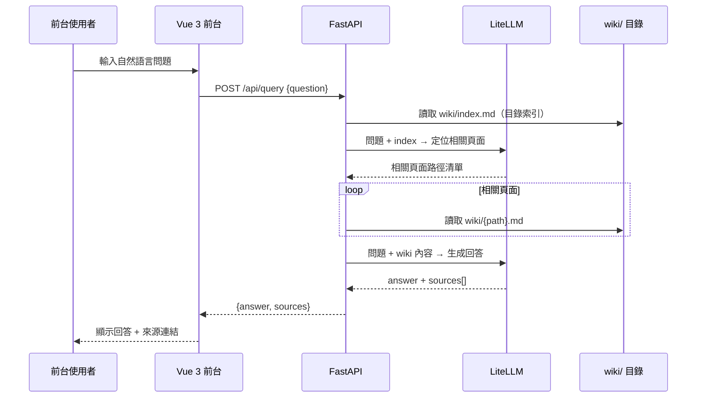
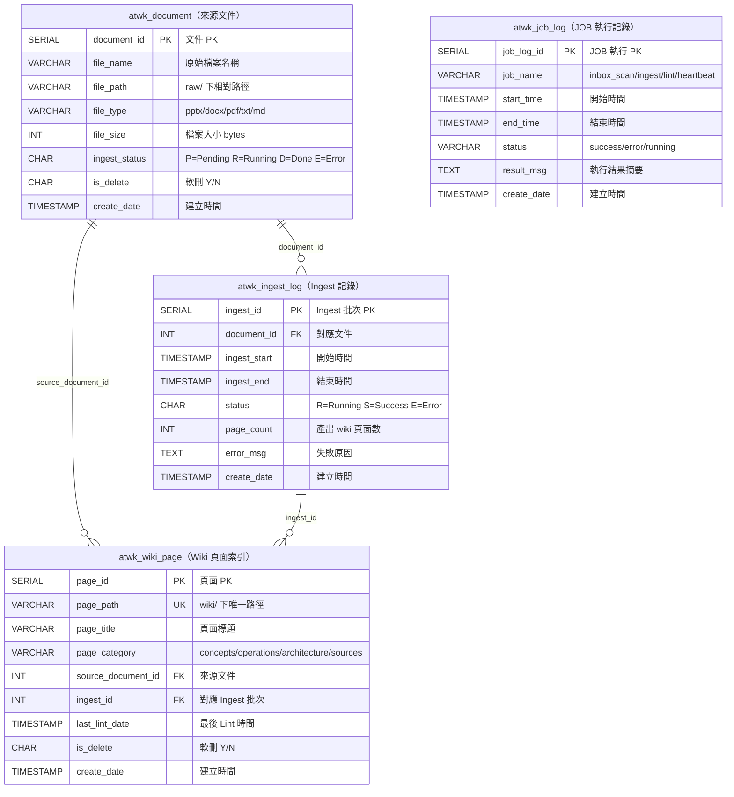

# ATWK — 系統架構藍圖 (ARCHITECTURE.md)

> 智能知識庫管理系統（Agent Wiki Knowledge Management System）
> 此文件為 Claude 實作參考用總覽，隨程式碼同步更新。

---

## 1. 系統全景圖



---

## 2. Ingest 資料流



**Ingest 流程摘要：**

```
管理員上傳 / inbox/ 有新檔
  → POST /admin/documents/upload  → inbox/ 寫檔 + DB (status=P)
  → POST /admin/ingest-logs/{doc_id}/trigger  → 背景 asyncio.Task 啟動
      → 讀 inbox/ → 移至 raw/（原始存檔，不再修改）
      → LLM 分析（強推理模式：80k chars context）
      → 產出 N 個 wiki/{category}/{slug}.md
      → INSERT atwk_wiki_page × N
      → UPDATE atwk_ingest_log (status=S, page_count=N)
      → UPDATE atwk_document (status=D)
      → 更新 wiki/index.md + wiki/log.md
```

---

## 3. Query 資料流



**Query 流程摘要：**

```
使用者輸入自然語言問題
  → POST /api/query {question}
  → 讀取 wiki/index.md → 取得全域目錄索引
  → LLM 定位相關頁（Query LLM：快速回應優先）
  → 讀取相關 wiki/*.md 頁面內容（可多頁）
  → LLM 綜合生成回答
  → 回傳 {answer: string, sources: [{title, path}]}
```

---

## 4. 資料庫 Schema（ER Diagram）



---

## 5. API 端點總覽

<table style="width:100%;border-collapse:collapse;font-size:0.88em;margin-bottom:0.5em;">
  <tr style="background:#1a6fa0;color:white;font-weight:bold;">
    <td style="padding:6px 12px;border:1px solid #7fb3d3;">方法</td>
    <td style="padding:6px 12px;border:1px solid #7fb3d3;">路徑</td>
    <td style="padding:6px 12px;border:1px solid #7fb3d3;">Auth</td>
    <td style="padding:6px 12px;border:1px solid #7fb3d3;">說明</td>
  </tr>
  <tr style="background:#f6ffed;">
    <td style="padding:6px 12px;border:1px solid #d6e8f5;font-weight:bold;color:#389e0d;">GET</td>
    <td style="padding:6px 12px;border:1px solid #d6e8f5;"><code>/health</code></td>
    <td style="padding:6px 12px;border:1px solid #d6e8f5;">無</td>
    <td style="padding:6px 12px;border:1px solid #d6e8f5;">服務健康檢查</td>
  </tr>
  <tr style="background:#ffffff;">
    <td style="padding:6px 12px;border:1px solid #d6e8f5;font-weight:bold;color:#0958d9;">POST</td>
    <td style="padding:6px 12px;border:1px solid #d6e8f5;"><code>/api/query</code></td>
    <td style="padding:6px 12px;border:1px solid #d6e8f5;">無</td>
    <td style="padding:6px 12px;border:1px solid #d6e8f5;">自然語言查詢 Wiki</td>
  </tr>
  <tr style="background:#f6ffed;">
    <td style="padding:6px 12px;border:1px solid #d6e8f5;font-weight:bold;color:#389e0d;">GET</td>
    <td style="padding:6px 12px;border:1px solid #d6e8f5;"><code>/api/wiki-pages</code></td>
    <td style="padding:6px 12px;border:1px solid #d6e8f5;">無</td>
    <td style="padding:6px 12px;border:1px solid #d6e8f5;">Wiki 頁面公開目錄</td>
  </tr>
  <tr style="background:#ffffff;">
    <td style="padding:6px 12px;border:1px solid #d6e8f5;font-weight:bold;color:#389e0d;">GET</td>
    <td style="padding:6px 12px;border:1px solid #d6e8f5;"><code>/api/checkin</code></td>
    <td style="padding:6px 12px;border:1px solid #d6e8f5;">無</td>
    <td style="padding:6px 12px;border:1px solid #d6e8f5;">健康狀態 + 向 APMS 打卡</td>
  </tr>
  <tr style="background:#fff7e6;">
    <td style="padding:6px 12px;border:1px solid #d6e8f5;font-weight:bold;color:#d46b08;">POST</td>
    <td style="padding:6px 12px;border:1px solid #d6e8f5;"><code>/admin/login</code></td>
    <td style="padding:6px 12px;border:1px solid #d6e8f5;">無</td>
    <td style="padding:6px 12px;border:1px solid #d6e8f5;">後台登入取得 Bearer Token</td>
  </tr>
  <tr style="background:#f6ffed;">
    <td style="padding:6px 12px;border:1px solid #d6e8f5;font-weight:bold;color:#389e0d;">GET</td>
    <td style="padding:6px 12px;border:1px solid #d6e8f5;"><code>/admin/dashboard</code></td>
    <td style="padding:6px 12px;border:1px solid #d6e8f5;">Bearer</td>
    <td style="padding:6px 12px;border:1px solid #d6e8f5;">儀表板彙整（服務狀態 / 統計 / 磁碟 / 排程）</td>
  </tr>
  <tr style="background:#ffffff;">
    <td style="padding:6px 12px;border:1px solid #d6e8f5;font-weight:bold;color:#d46b08;">POST</td>
    <td style="padding:6px 12px;border:1px solid #d6e8f5;"><code>/admin/documents/upload</code></td>
    <td style="padding:6px 12px;border:1px solid #d6e8f5;">Bearer</td>
    <td style="padding:6px 12px;border:1px solid #d6e8f5;">上傳文件至 inbox/</td>
  </tr>
  <tr style="background:#f6ffed;">
    <td style="padding:6px 12px;border:1px solid #d6e8f5;font-weight:bold;color:#389e0d;">GET</td>
    <td style="padding:6px 12px;border:1px solid #d6e8f5;"><code>/admin/documents</code></td>
    <td style="padding:6px 12px;border:1px solid #d6e8f5;">Bearer</td>
    <td style="padding:6px 12px;border:1px solid #d6e8f5;">文件列表（含狀態篩選）</td>
  </tr>
  <tr style="background:#ffffff;">
    <td style="padding:6px 12px;border:1px solid #d6e8f5;font-weight:bold;color:#d46b08;">POST</td>
    <td style="padding:6px 12px;border:1px solid #d6e8f5;"><code>/admin/ingest-logs/{doc_id}/trigger</code></td>
    <td style="padding:6px 12px;border:1px solid #d6e8f5;">Bearer</td>
    <td style="padding:6px 12px;border:1px solid #d6e8f5;">手動觸發 Ingest</td>
  </tr>
  <tr style="background:#f6ffed;">
    <td style="padding:6px 12px;border:1px solid #d6e8f5;font-weight:bold;color:#389e0d;">GET</td>
    <td style="padding:6px 12px;border:1px solid #d6e8f5;"><code>/admin/ingest-logs</code></td>
    <td style="padding:6px 12px;border:1px solid #d6e8f5;">Bearer</td>
    <td style="padding:6px 12px;border:1px solid #d6e8f5;">Ingest 歷程列表</td>
  </tr>
  <tr style="background:#ffffff;">
    <td style="padding:6px 12px;border:1px solid #d6e8f5;font-weight:bold;color:#389e0d;">GET</td>
    <td style="padding:6px 12px;border:1px solid #d6e8f5;"><code>/admin/wiki-pages</code></td>
    <td style="padding:6px 12px;border:1px solid #d6e8f5;">Bearer</td>
    <td style="padding:6px 12px;border:1px solid #d6e8f5;">Wiki 頁面列表（含搜尋）</td>
  </tr>
  <tr style="background:#f6ffed;">
    <td style="padding:6px 12px;border:1px solid #d6e8f5;font-weight:bold;color:#d46b08;">POST</td>
    <td style="padding:6px 12px;border:1px solid #d6e8f5;"><code>/admin/wiki-pages/lint</code></td>
    <td style="padding:6px 12px;border:1px solid #d6e8f5;">Bearer</td>
    <td style="padding:6px 12px;border:1px solid #d6e8f5;">手動觸發 Lint</td>
  </tr>
  <tr style="background:#ffffff;">
    <td style="padding:6px 12px;border:1px solid #d6e8f5;font-weight:bold;color:#389e0d;">GET</td>
    <td style="padding:6px 12px;border:1px solid #d6e8f5;"><code>/admin/job-logs</code></td>
    <td style="padding:6px 12px;border:1px solid #d6e8f5;">Bearer</td>
    <td style="padding:6px 12px;border:1px solid #d6e8f5;">JOB 執行記錄查詢</td>
  </tr>
  <tr style="background:#f6ffed;">
    <td style="padding:6px 12px;border:1px solid #d6e8f5;font-weight:bold;color:#389e0d;">GET</td>
    <td style="padding:6px 12px;border:1px solid #d6e8f5;"><code>/admin/scheduler/status</code></td>
    <td style="padding:6px 12px;border:1px solid #d6e8f5;">Bearer</td>
    <td style="padding:6px 12px;border:1px solid #d6e8f5;">排程器 JOB 狀態與下次執行時間</td>
  </tr>
  <tr style="background:#ffffff;">
    <td style="padding:6px 12px;border:1px solid #d6e8f5;font-weight:bold;color:#389e0d;">GET</td>
    <td style="padding:6px 12px;border:1px solid #d6e8f5;"><code>/admin/settings/llm</code></td>
    <td style="padding:6px 12px;border:1px solid #d6e8f5;">Bearer</td>
    <td style="padding:6px 12px;border:1px solid #d6e8f5;">讀取 Ingest / Query 雙 LLM 設定</td>
  </tr>
  <tr style="background:#f6ffed;">
    <td style="padding:6px 12px;border:1px solid #d6e8f5;font-weight:bold;color:#d46b08;">PATCH</td>
    <td style="padding:6px 12px;border:1px solid #d6e8f5;"><code>/admin/settings/llm</code></td>
    <td style="padding:6px 12px;border:1px solid #d6e8f5;">Bearer</td>
    <td style="padding:6px 12px;border:1px solid #d6e8f5;">in-memory 更新指定角色 LLM 模型</td>
  </tr>
  <tr style="background:#ffffff;">
    <td style="padding:6px 12px;border:1px solid #d6e8f5;font-weight:bold;color:#d46b08;">POST</td>
    <td style="padding:6px 12px;border:1px solid #d6e8f5;"><code>/admin/settings/llm/test</code></td>
    <td style="padding:6px 12px;border:1px solid #d6e8f5;">Bearer</td>
    <td style="padding:6px 12px;border:1px solid #d6e8f5;">測試指定角色 LLM 連線（回傳延遲）</td>
  </tr>
</table>

---

## 6. 實作層次對應

<table style="width:100%;border-collapse:collapse;font-size:0.88em;margin-bottom:0.5em;">
  <tr style="background:#1a6fa0;color:white;font-weight:bold;">
    <td style="padding:6px 12px;border:1px solid #7fb3d3;width:60px;">Layer</td>
    <td style="padding:6px 12px;border:1px solid #7fb3d3;">對應模組</td>
    <td style="padding:6px 12px;border:1px solid #7fb3d3;">驗收標準</td>
    <td style="padding:6px 12px;border:1px solid #7fb3d3;width:120px;text-align:center;">狀態</td>
  </tr>
  <tr style="background:#ffffff;">
    <td style="padding:6px 12px;border:1px solid #d6e8f5;font-weight:bold;text-align:center;">1</td>
    <td style="padding:6px 12px;border:1px solid #d6e8f5;"><code>db/migration_001_init.sql</code><br><code>api/config.py</code> <code>api/database.py</code></td>
    <td style="padding:6px 12px;border:1px solid #d6e8f5;">db_atwk 建立；4 張表 OK；FastAPI /health 通</td>
    <td style="padding:6px 12px;border:1px solid #d6e8f5;text-align:center;">✅</td>
  </tr>
  <tr style="background:#eaf3fb;">
    <td style="padding:6px 12px;border:1px solid #d6e8f5;font-weight:bold;text-align:center;">2</td>
    <td style="padding:6px 12px;border:1px solid #d6e8f5;"><code>api/llm.py</code> <code>job/ingest.py</code><br><code>job/parsers.py</code> <code>api/routers/query.py</code></td>
    <td style="padding:6px 12px;border:1px solid #d6e8f5;">LLM Ingest 核心；Query API 回傳 answer + sources</td>
    <td style="padding:6px 12px;border:1px solid #d6e8f5;text-align:center;">✅</td>
  </tr>
  <tr style="background:#ffffff;">
    <td style="padding:6px 12px;border:1px solid #d6e8f5;font-weight:bold;text-align:center;">3</td>
    <td style="padding:6px 12px;border:1px solid #d6e8f5;"><code>api/routers/admin_*.py</code><br><code>backend/admin.html</code></td>
    <td style="padding:6px 12px;border:1px solid #d6e8f5;">後台登入 / 文件管理 / Ingest 觸發 / Wiki 管理</td>
    <td style="padding:6px 12px;border:1px solid #d6e8f5;text-align:center;">✅</td>
  </tr>
  <tr style="background:#eaf3fb;">
    <td style="padding:6px 12px;border:1px solid #d6e8f5;font-weight:bold;text-align:center;">4</td>
    <td style="padding:6px 12px;border:1px solid #d6e8f5;"><code>frontend/index.html</code><br><code>api/routers/wiki_public.py</code></td>
    <td style="padding:6px 12px;border:1px solid #d6e8f5;">前台查詢 / Wiki 瀏覽 / 教學說明 三 Tab</td>
    <td style="padding:6px 12px;border:1px solid #d6e8f5;text-align:center;">✅</td>
  </tr>
  <tr style="background:#ffffff;">
    <td style="padding:6px 12px;border:1px solid #d6e8f5;font-weight:bold;text-align:center;">5</td>
    <td style="padding:6px 12px;border:1px solid #d6e8f5;"><code>job/scheduler.py</code> <code>job/inbox_scan.py</code><br><code>job/lint.py</code> <code>api/routers/admin_jobs.py</code></td>
    <td style="padding:6px 12px;border:1px solid #d6e8f5;">APScheduler 3 JOB 運行；JOB 記錄查詢 OK</td>
    <td style="padding:6px 12px;border:1px solid #d6e8f5;text-align:center;">✅</td>
  </tr>
  <tr style="background:#eaf3fb;">
    <td style="padding:6px 12px;border:1px solid #d6e8f5;font-weight:bold;text-align:center;">6</td>
    <td style="padding:6px 12px;border:1px solid #d6e8f5;"><code>external/agentpulse.py</code><br><code>api/routers/checkin.py</code></td>
    <td style="padding:6px 12px;border:1px solid #d6e8f5;">Heartbeat 向 APMS 打卡；/api/checkin OK</td>
    <td style="padding:6px 12px;border:1px solid #d6e8f5;text-align:center;">✅</td>
  </tr>
  <tr style="background:#ffffff;">
    <td style="padding:6px 12px;border:1px solid #d6e8f5;font-weight:bold;text-align:center;">7</td>
    <td style="padding:6px 12px;border:1px solid #d6e8f5;"><code>tests/e2e_test.py</code> <code>tests/run_tests.py</code></td>
    <td style="padding:6px 12px;border:1px solid #d6e8f5;">e2e 全流程 9/11 pass（2 項需 LLM key）</td>
    <td style="padding:6px 12px;border:1px solid #d6e8f5;text-align:center;">✅ 9/11</td>
  </tr>
  <tr style="background:#eaf3fb;">
    <td style="padding:6px 12px;border:1px solid #d6e8f5;font-weight:bold;text-align:center;">+</td>
    <td style="padding:6px 12px;border:1px solid #d6e8f5;"><code>api/routers/admin_dashboard.py</code></td>
    <td style="padding:6px 12px;border:1px solid #d6e8f5;">後台儀表板：服務狀態 / 統計 / 磁碟 / 排程 / 最近 Ingest</td>
    <td style="padding:6px 12px;border:1px solid #d6e8f5;text-align:center;">✅</td>
  </tr>
</table>

---

## 7. LLM 路由策略（雙 LLM 設計）

ATWK 將 LLM 用途拆為兩個角色，由 `api/config.py` 的 `ingest_*` / `query_*` properties 管理，留空則 fallback 至共用 `ATWK_LLM_*`。

<table style="width:100%;border-collapse:collapse;font-size:0.88em;margin-bottom:1em;">
  <tr style="background:#1a6fa0;color:white;font-weight:bold;">
    <td style="padding:6px 12px;border:1px solid #7fb3d3;">角色</td>
    <td style="padding:6px 12px;border:1px solid #7fb3d3;">調用位置</td>
    <td style="padding:6px 12px;border:1px solid #7fb3d3;">需求特性</td>
    <td style="padding:6px 12px;border:1px solid #7fb3d3;">建議模型</td>
    <td style="padding:6px 12px;border:1px solid #7fb3d3;">環境變數</td>
  </tr>
  <tr style="background:#fff7e6;">
    <td style="padding:6px 12px;border:1px solid #d6e8f5;font-weight:bold;">Ingest LLM</td>
    <td style="padding:6px 12px;border:1px solid #d6e8f5;"><code>job/ingest.py</code><br><code>chat_ingest()</code></td>
    <td style="padding:6px 12px;border:1px solid #d6e8f5;">強推理、大 context（80k chars）、穩定 JSON 輸出</td>
    <td style="padding:6px 12px;border:1px solid #d6e8f5;">Gemini 2.5 Flash<br>Claude Sonnet<br>GPT-4o</td>
    <td style="padding:6px 12px;border:1px solid #d6e8f5;"><code>ATWK_LLM_INGEST_MODEL</code></td>
  </tr>
  <tr style="background:#f0f7ff;">
    <td style="padding:6px 12px;border:1px solid #d6e8f5;font-weight:bold;">Query LLM</td>
    <td style="padding:6px 12px;border:1px solid #d6e8f5;"><code>api/routers/query.py</code><br><code>chat_query()</code></td>
    <td style="padding:6px 12px;border:1px solid #d6e8f5;">快速回應（使用者即時等待）、問答能力</td>
    <td style="padding:6px 12px;border:1px solid #d6e8f5;">同上，或地端 7B-14B</td>
    <td style="padding:6px 12px;border:1px solid #d6e8f5;"><code>ATWK_LLM_QUERY_MODEL</code></td>
  </tr>
</table>

**後台切換（in-memory）：** 管理員可於後台「⚙️ LLM 設定」即時套用新模型，重啟服務後恢復 `.env` 值。

**地端模型文件格式適合度：**

| 文件格式 | 地端 7B-14B | 地端 32B+ | 備註 |
|---------|------------|----------|------|
| MD / TXT | ✅ 最穩 | ✅ 最穩 | 首選，JSON 輸出穩定 |
| DOCX / PDF | ✅ 大多 OK | ✅ OK | — |
| CSV / XLSX | ⚠️ 易崩潰 | ✅ 大多 OK | 建議搭配 API 模型 |

---

## 8. 模組對應

<table style="width:100%;border-collapse:collapse;font-size:0.88em;margin-bottom:0.5em;">
  <tr style="background:#1a6fa0;color:white;font-weight:bold;">
    <td style="padding:6px 12px;border:1px solid #7fb3d3;">模組</td>
    <td style="padding:6px 12px;border:1px solid #7fb3d3;">資料夾 / 檔案</td>
    <td style="padding:6px 12px;border:1px solid #7fb3d3;">Port / Path</td>
    <td style="padding:6px 12px;border:1px solid #7fb3d3;">說明</td>
  </tr>
  <tr style="background:#ffffff;">
    <td style="padding:6px 12px;border:1px solid #d6e8f5;font-weight:bold;">FastAPI 主服務</td>
    <td style="padding:6px 12px;border:1px solid #d6e8f5;"><code>api/main.py</code></td>
    <td style="padding:6px 12px;border:1px solid #d6e8f5;"><code>:8300</code></td>
    <td style="padding:6px 12px;border:1px solid #d6e8f5;">Lifespan 管理 DB Pool + APScheduler</td>
  </tr>
  <tr style="background:#eaf3fb;">
    <td style="padding:6px 12px;border:1px solid #d6e8f5;font-weight:bold;">前台 WEB</td>
    <td style="padding:6px 12px;border:1px solid #d6e8f5;"><code>frontend/index.html</code></td>
    <td style="padding:6px 12px;border:1px solid #d6e8f5;"><code>GET /</code></td>
    <td style="padding:6px 12px;border:1px solid #d6e8f5;">Vue 3 CDN；自然語言查詢 / Wiki 瀏覽 / 說明</td>
  </tr>
  <tr style="background:#ffffff;">
    <td style="padding:6px 12px;border:1px solid #d6e8f5;font-weight:bold;">後台管理 WEB</td>
    <td style="padding:6px 12px;border:1px solid #d6e8f5;"><code>backend/admin.html</code></td>
    <td style="padding:6px 12px;border:1px solid #d6e8f5;"><code>GET /admin</code></td>
    <td style="padding:6px 12px;border:1px solid #d6e8f5;">Vue 3 CDN；Token 登入，管理文件 / Wiki / JOB</td>
  </tr>
  <tr style="background:#eaf3fb;">
    <td style="padding:6px 12px;border:1px solid #d6e8f5;font-weight:bold;">後台儀表板 API</td>
    <td style="padding:6px 12px;border:1px solid #d6e8f5;"><code>api/routers/admin_dashboard.py</code></td>
    <td style="padding:6px 12px;border:1px solid #d6e8f5;"><code>GET /admin/dashboard</code></td>
    <td style="padding:6px 12px;border:1px solid #d6e8f5;">彙整服務狀態 / 統計 / 磁碟 / 排程 / 最近 Ingest</td>
  </tr>
  <tr style="background:#ffffff;">
    <td style="padding:6px 12px;border:1px solid #d6e8f5;font-weight:bold;">JOB 排程</td>
    <td style="padding:6px 12px;border:1px solid #d6e8f5;"><code>job/scheduler.py</code><br><code>job/ingest.py</code> <code>job/lint.py</code></td>
    <td style="padding:6px 12px;border:1px solid #d6e8f5;">—</td>
    <td style="padding:6px 12px;border:1px solid #d6e8f5;">APScheduler：inbox_scan / daily_lint / heartbeat</td>
  </tr>
  <tr style="background:#eaf3fb;">
    <td style="padding:6px 12px;border:1px solid #d6e8f5;font-weight:bold;">異質系統整合</td>
    <td style="padding:6px 12px;border:1px solid #d6e8f5;"><code>external/agentpulse.py</code></td>
    <td style="padding:6px 12px;border:1px solid #d6e8f5;">—</td>
    <td style="padding:6px 12px;border:1px solid #d6e8f5;">AgentPULSE APMS 心跳打卡</td>
  </tr>
  <tr style="background:#ffffff;">
    <td style="padding:6px 12px;border:1px solid #d6e8f5;font-weight:bold;">DB Migration</td>
    <td style="padding:6px 12px;border:1px solid #d6e8f5;"><code>db/migration_001_init.sql</code></td>
    <td style="padding:6px 12px;border:1px solid #d6e8f5;">—</td>
    <td style="padding:6px 12px;border:1px solid #d6e8f5;">建立 db_atwk 及 4 張業務資料表</td>
  </tr>
  <tr style="background:#eaf3fb;">
    <td style="padding:6px 12px;border:1px solid #d6e8f5;font-weight:bold;">E2E 測試</td>
    <td style="padding:6px 12px;border:1px solid #d6e8f5;"><code>tests/e2e_test.py</code><br><code>tests/run_tests.py</code></td>
    <td style="padding:6px 12px;border:1px solid #d6e8f5;">—</td>
    <td style="padding:6px 12px;border:1px solid #d6e8f5;">全流程 e2e；9/11 pass（2 項需 LLM quota）</td>
  </tr>
</table>

---

## 9. 知識庫載體選型：Obsidian vs ATWK 自建系統

ATWK 的 Wiki 概念源自 Karpathy 提出的「Raw / Wiki / Schema 三層分工 + Ingest / Query / Lint 操作循環」，原始文章以 Obsidian 作為知識載體。ATWK 改用自建系統，差異如下：

<table style="width:100%;border-collapse:collapse;font-size:0.88em;margin-bottom:0.5em;">
  <tr style="background:#1a6fa0;color:white;font-weight:bold;">
    <td style="padding:6px 12px;border:1px solid #7fb3d3;">面向</td>
    <td style="padding:6px 12px;border:1px solid #7fb3d3;">文章（Karpathy 概念）</td>
    <td style="padding:6px 12px;border:1px solid #7fb3d3;">ATWK 專案</td>
  </tr>
  <tr style="background:#ffffff;">
    <td style="padding:6px 12px;border:1px solid #d6e8f5;font-weight:bold;">知識存放</td>
    <td style="padding:6px 12px;border:1px solid #d6e8f5;">Obsidian vault（本機 .md + 雙向連結）</td>
    <td style="padding:6px 12px;border:1px solid #d6e8f5;"><code>wiki/</code> 資料夾（純 .md）+ PostgreSQL 索引</td>
  </tr>
  <tr style="background:#eaf3fb;">
    <td style="padding:6px 12px;border:1px solid #d6e8f5;font-weight:bold;">使用情境</td>
    <td style="padding:6px 12px;border:1px solid #d6e8f5;">個人知識管理、單人使用</td>
    <td style="padding:6px 12px;border:1px solid #d6e8f5;">部門級系統、多人透過 Web UI 查詢</td>
  </tr>
  <tr style="background:#ffffff;">
    <td style="padding:6px 12px;border:1px solid #d6e8f5;font-weight:bold;">查詢介面</td>
    <td style="padding:6px 12px;border:1px solid #d6e8f5;">直接在 Obsidian 裡問 LLM</td>
    <td style="padding:6px 12px;border:1px solid #d6e8f5;">前台 Vue 3 Web UI（REST API）</td>
  </tr>
  <tr style="background:#eaf3fb;">
    <td style="padding:6px 12px;border:1px solid #d6e8f5;font-weight:bold;">視覺化</td>
    <td style="padding:6px 12px;border:1px solid #d6e8f5;">Obsidian 的知識圖譜</td>
    <td style="padding:6px 12px;border:1px solid #d6e8f5;">無（不是需求）</td>
  </tr>
  <tr style="background:#ffffff;">
    <td style="padding:6px 12px;border:1px solid #d6e8f5;font-weight:bold;">操作者</td>
    <td style="padding:6px 12px;border:1px solid #d6e8f5;">使用者自己 + LLM</td>
    <td style="padding:6px 12px;border:1px solid #d6e8f5;">後台排程 JOB + API 驅動</td>
  </tr>
</table>

**核心結論：**

Obsidian 在文章裡是「載體」，不是「必要元件」。文章的比喻是「Obsidian 是 IDE，LLM 是 programmer，Wiki 是 codebase」——重點是 **Wiki 這個概念**（raw / wiki / schema 三層分工、Ingest / Query / Lint 三個操作），Obsidian 只是作者個人選擇的容器。

ATWK 實作了同樣的概念，只是把容器換成：

- 檔案系統（`wiki/` .md 給 LLM 讀寫）
- PostgreSQL（給 API 查詢）
- Vue Web UI（給使用者操作）

這樣才符合「部門級、可部署、有後台管理」的需求，Obsidian 是沒辦法多人共用的。
